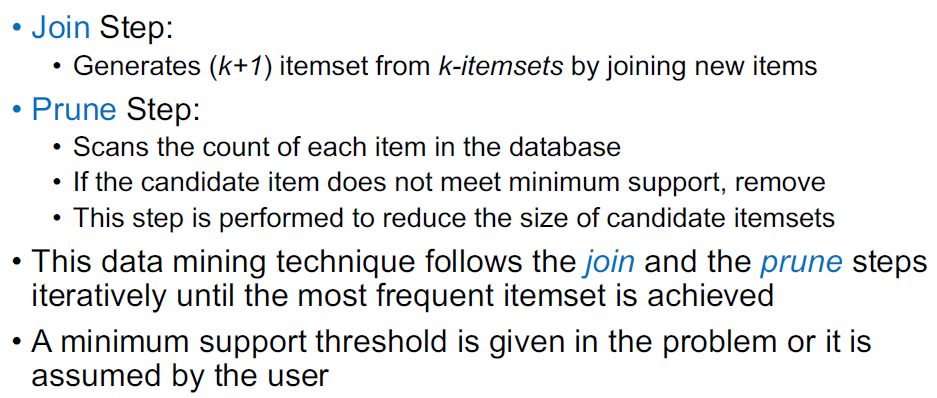
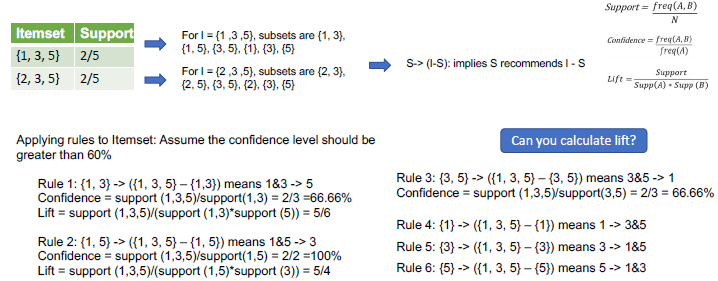

# Data Types

## 结构化数据Structured Data

data with a high degree of organization

特点：

1. 存储在关系型数据库或文件中（Data stored in a relational databases or files）
2. 访问便捷（Easily accessible）
3. 使用方便（Easy to use）
4. 分析方便（Easy to analyze）

## 非结构化数据Unstructured Data

特点：

1. no structure
2. 处理耗时很长（Time consuming to work with）

### Image

Digital images can be read by computer as a combination of pixels

#### Grayscale image

灰度图像 只有一个黑白的channel（one pixel channel）

#### RGB image

由红绿蓝组成的三通道照片

## 半结构化数据Semi-Structured Data

有一定结构，但是需要再进行处理才能展示成结构化的格式（some structure, but require some work to put into a structured format）

* log file、XML file、JSON file

## 交易数据Transactional Data

并不知道为什么老师给单独放一类，应该是他自己研究这个

总体来说，是多个表关联的数据，包含了用户购买、请求、供应链、订单配送等多方面的数据的集合。

## Rules

### 人类领域知识Human’s Expertise

人类处理过程（尤其是心理过程）是综合且复杂的，并不能通过程序进行描述。但是部分的知识是可以通过规则进行刻画。

### Rules as Knowledge

简单的关系可以用if-then进行描述。一个规则应该能提供解决问题的信息（A rule provides some information how to solve a problem）

$$
IF\ \ <Antecedent>\ \ THEN\ \ <Consequent>
$$

关系可以通过前因（Antecedent）和后果（Consequent）来描述，刻画了依赖条件。

复杂的关系可以通过逻辑语句（AND（conjunction）、OR（disjunction））组合进行描述（Multiple antecedents joined by the keywords AND (conjunction), OR (disjunction) or a combination of both）

### Association Rules

通常与频繁项集有关，描述了数据中常出现的组合（即物品间的关联关系）

#### Association Rules和Collaborative Filtering的区别

* Association Rules 包含了所有的Transactions（Association rules combine all the transactions）
* CF只识别用户的喜好（Collaborative filtering identifies users’ preferences: recommender system）

### 频繁项集Frequent Itemset

#### Itemset： a set of items

一个itemset由k-items被称为k-itemset，通常由两个以上。如果某个itemset出现的次数很频繁，那么被称为频繁项集（a frequent itemset）

#### Frequent Pattern Mining

是关系和规则挖掘中的重要技术（One of the most important techniques of data mining to discover relationships between different items in a dataset.）

关系可以通过association rules来表征（Relationships are represented in the form of association rules）

### 评价指标Measures

#### 支持度Support

$$
Support=\frac{freq(A \to B)}{N}
$$

是AB组合出现的频率，可以用作过滤的阈值。

#### 信赖度（置信度）Confidence

$$
Confidence=\frac {freq(A \to B)}{freq(A)}
$$

衡量在A的情况下，出现B的可能性。属于条件概率。但是是有偏的先验概率。

#### 提升度Lift

$$
Lift=\frac{Support(A \to B)}{Support(A) \cdot Support(B)}
$$

如果提升度Lift大于1，证明出现概率更大

### Apriori算法

简单地说，就是通过组合和过滤的迭代，依次将频繁项集寻找出来。

<figure><figcaption></figcaption></figure>

找到频繁项集后，根据Confidence阈值或者Lift阈值提取规则

<figure><figcaption></figcaption></figure>

## Graph and Networked Data

图是描述和分析实体间关系或交互的通用语言。有时候图和网络的界限是模糊的（blurred）

图（Graph, as a representation）的特点是

1. 数据是高度组织且关联的（Information/knowledge are organized and linked）
2. 可以进行图的相关性分析（Similarity networks: connect similar data points）
3. 可以通过关系模型对图进行刻画（Relational structures: Molecules, Scene graphs, 3D shapes, Particlebased physics simulations）

## Sequence Data

序列数据就是将数据先后顺序考虑在内的数据（Sequential Data is any kind of data where the order matters）。
