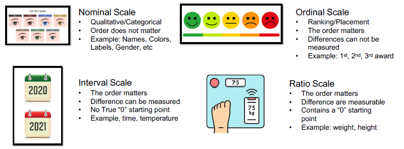

# General Information

## 基本概念

### 数据分析的发展史

<table><thead><tr><th width="133">Decades</th><th>Technology &#x26; Methodology</th></tr></thead><tbody><tr><td>1763</td><td>Baye's theorem</td></tr><tr><td>1805</td><td>Regression Analysis</td></tr><tr><td>1936</td><td>Alan Turing应用大型机器（类计算机）处理数据</td></tr><tr><td>1943</td><td>定义了神经网络：每个神经元接受输入、处理数据并输出</td></tr><tr><td>1960s</td><td>模糊逻辑（Fuzzy Logic）进化算法（evolutionary programming）、近邻分析（nearest neighbor）</td></tr><tr><td>1970s</td><td>梯度回传（backpropagation）、遗传算法（genetic algorithms）、卷积网络</td></tr><tr><td>1980s</td><td>强化学习（reinforcement learning）、循环神经网络（recurrent neural networks）、决策树、自编码器（autoencoders）、Q-Learning、数据知识图谱（Knowledge Discovery in Databases, KDD）</td></tr><tr><td>1990s</td><td>Boosting、SVM、随机森林、LSTM、Deep Blue in IBM</td></tr><tr><td>2000s</td><td>Data science is introduced as an independent discipline; Data analytics</td></tr><tr><td>2010s</td><td>大数据、深度学习</td></tr></tbody></table>

### 什么是Data Science

* DS是跨学科的领域（Data science is an interdisciplinary field），重点：是个领域（Domain）
* 使用科学的方法从结构化和非结构化的数据中提取知识和规律（It uses scientific methods, processes, algorithms and systems to extract knowledge and insights from structured and unstructured data）
* 最后将提取的知识和规律应用在更大范围的应用领域中（it applies knowledge and actionable insights from data across a broad range of application domains）

### 什么是Statistical Analysis

通常是数论的子领域，包括了概率和优化（probability and optimization）

### 什么是Machine Learning

ML是研究如何从数据中利用合适的计算机算法提取对应的知识与经验的学科（Machine learning (ML) is the study of computer algorithms that improve automatically through experience and by the use of data (i.e., without on-line human guidance）

### 什么是Artificial/machine intelligence

是用来模拟人类智慧的程序机制（Mechanisms programmed to simulate human intelligence）

### 什么是数据挖掘Data Mining

是从数据集中寻找知识和规律的过程（The process to generate new information and discover patterns from datasets），通常包含机器学习、统计学、数据库原理等技术（Data mining is the process of extracting and discovering patterns in large data sets involving methods at the intersection of ML, statistics, and database systems）

* 通常数据集是massive和complicated的，或许也会有很多特定的

### 什么是Pattern Recognition

通过科学的方法将给定的输入划分成预定的类别中（Pattern recognition is the term given to the science of automating the classification of input into pre-determined categories）

* 与数据挖掘不同的是，模式识别实现知道pattern，但是数据挖掘不一定

### 什么是Data Analytics

* DA是一种针对数据或统计意义上的系统的计算分析方法（Analytics is the systematic computational analysis of data or statistics）
* areas within analytics includes
  * predictive analytics
  * enterprise decision management
  * 大数据分析
  * retail analytics
* Data mining is a step in the data analytics process

### 什么是Advanced Analytics

* 高级分析是通过自动化或半自动化的算法和复杂的技术工具，对既定数据挖掘观点、做出预测或生成推荐（Advanced Analytics is the autonomous or semi-autonomous examination of data or content using sophisticated techniques and tools, typically beyond those of traditional business intelligence (BI), to discover deeper insights, make predictions, or generate recommendations）
* 这些技术包括：data/text mining, machine learning, pattern matching, forecasting, visualization, semantic analysis, sentiment analysis, network and cluster analysis, multivariate statistics, graph analysis, simulation, complex event processing, neural networks

## 大数据3V

### Volume

数据大小很大（The volume of the data is its size, and how enormous it is）

### Variety

数据格式、种类和使用方式多（variety includes the different formats and types of data, as well as the different kinds of uses and ways of analyzing the data）

### Velocity

数据更新的速度很快（Velocity refers to the rate with which data is changing, or how often it is created）

## 数据分析

### 数据分析的阶段

| Preparation        | Preprocessing   | Analysis       | Postprocessing |
| ------------------ | --------------- | -------------- | -------------- |
| Planning           | Cleaning        | Visualization  | Interpretation |
| Data colllection   | Filtering       | Correlation    | Documentation  |
| Feature generation | Completion      | Regression     | Evaluation     |
| Data selection     | Correction      | Forecasting    |                |
|                    | Standardization | Classification |                |
|                    | Transformation  | Clustering     |                |

* Preparation：获取和选择数据（Assess & select data）
* Preprocessing：数据清洗和过滤
* Analysis：可视化和分析
* Postprocessing：分析结果是可解释和可量化的（the analysis results are interpreted and evaluated）

### 什么是数据

A collection of measurement or observations？

#### Quantitative (numerical) data

* Discrete data: counting, e.g., the number of pets one person have
* Continuous data: measuring, e.g., the length of the pet

#### Qualitative (categorical) data

describes the qualities of data points and is non-numerical

### Scales of Measurement

<figure><figcaption>
4 Types of measurement
</figcaption></figure>

#### Operations in Different Scales

<table><thead><tr><th width="232">Operations</th><th data-type="checkbox">Nominal</th><th data-type="checkbox">Ordinal</th><th data-type="checkbox">Interval</th><th data-type="checkbox">Ratio</th></tr></thead><tbody><tr><td>Frequency distribution</td><td>true</td><td>true</td><td>true</td><td>true</td></tr><tr><td>Mode</td><td>true</td><td>true</td><td>true</td><td>true</td></tr><tr><td>Median</td><td>false</td><td>true</td><td>true</td><td>true</td></tr><tr><td>Addition and subtraction</td><td>false</td><td>false</td><td>true</td><td>true</td></tr><tr><td>Mean, standard deviation</td><td>false</td><td>false</td><td>true</td><td>true</td></tr><tr><td>Multiplication and division</td><td>false</td><td>false</td><td>false</td><td>true</td></tr><tr><td>Ratios, coefficient of variation</td><td>false</td><td>false</td><td>false</td><td>true</td></tr><tr><td>Geometric mean</td><td>false</td><td>false</td><td>false</td><td>true</td></tr></tbody></table>

#### Different types of Means

$$
HarmonicMean(x_1, x_2, \cdots,x_n) = \frac {n} {\frac{1} {x_1}+\frac{1} {x_2}+\cdots+\frac{1} {x_n}}
$$

1. 算数平均
2. 加权平均
3.  调和平均（Harmonic mean）

    物理中经常使用（例如速率）
4.  几何平均（Geometric mean）

    金融、社会科学中经常使用（例如平均概率）

### 什么是关系Relations

用来描述一对实体相似与否、兼容与否和距离是否接近的程度（Refer to a degree of similarity, dissimilarity, compatibility, incompatibility, proximity or distance between a pair of objects）

* Similarities（一对一）：0 (no similarity) and 1 (complete similarity)
* Dissimilarities（一对多）：0 (objects are alike) to ∞ (objects are different)
* The term proximity is used to refer to either similarity or dissimilarity

### 衡量数据间的距离
