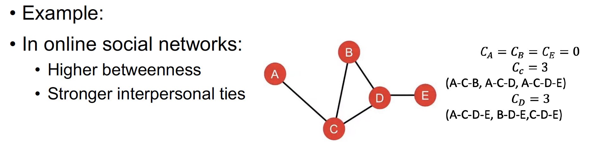

# Language Model

*   收集一个大的语料数据集

    Get a big corpus of text which is a sequence of words
*   投喂进模型，并且计算下一个时间步的词分布

    Feed into Language Models, compute output distribution for every step T
* 计算输出和真实下一个词的交叉熵损失
* 损失函数其实是求解所有时间步的连乘，通过log变换转换为累加

<figure><figcaption></figcaption></figure>

如果计算整个语料库的自回归的话，计算开销巨大。所以实践中我们采用句子维度的方式，通过随机梯度下降从小chunk中更新模型。

## Evaluating Language Models

### 困惑度 Perplexity

<figure><figcaption></figcaption></figure>

很有意思的是，困惑度就等于交叉熵损失

<figure><figcaption></figcaption></figure>

## RNN-LM

## Machine Translation

### Statistical Machine Translation (SMT)

Machine Translation (MT) is the task of translating a sentence x from one language (the source language) to a sentence y in another language (the target language)

* 1950s: Russian to English, motivated by the Cold War
  * rule-based
* 1990s-2010s: Statistical Machine Translation
  * Probabilistic model
  * Bayes Rule- break this down into two components to be learnt separately
    * P(x|y): Translation Model
    * P(y): Language Model
  * Hundreds of important details we haven't mentioned here
  * Systems had many separately-designed subcomponents
  * Lots of feature engineering
  * Require compiling and maintaining extra resources
  * Lots of human effort to maintain

#### Decoding for SMT (Heuristic search algorithm)

$$
argmax_y\ P(x|y) P(y)
$$

### Neural Machine Translation (NMT)

最早的NMT是2014年，通过两个RNN网络进行的seq2seq网络。

Seq2Seq的任务模式可以使用在多种任务中：

* Summarization
* Dialogue
* Parsing
* Code generation

端到端训练，自回归的方式修正参数

