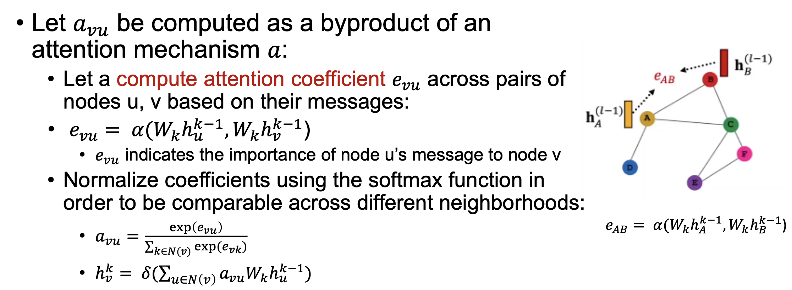

# 语言模型的种类

## 语言模型的种类

### Next Word Prediction

<figure><figcaption></figcaption></figure>

### Sentence Prediction

<figure><figcaption></figcaption></figure>

### Application in Speech Recognition

<figure><figcaption></figcaption></figure>

### Application in Machine Translation

<figure><figcaption></figcaption></figure>

## Real-Word Spelling or Grammatical Error Correction

<figure><figcaption></figcaption></figure>
