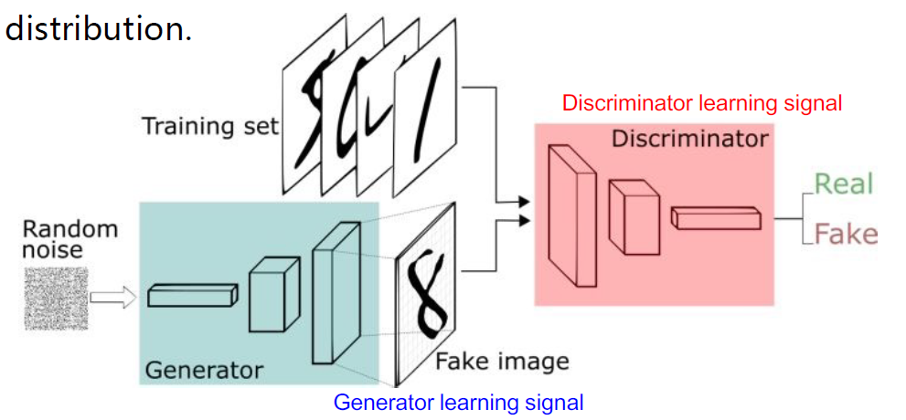
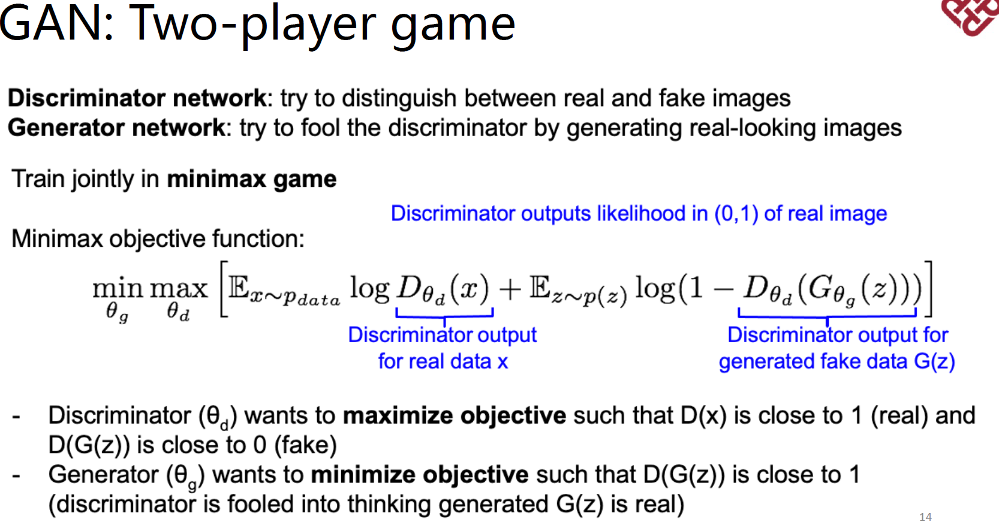

# Advanced AI Techniques

## GAN(Generative Adversarial Nets)

联合训练生成器和判别器

<figure><figcaption>
Visualization of GAN
</figcaption></figure>

### Objective

$$
\min_{\theta_g}\max_{\theta_d}[\mathbb{E}_{x \to p_{data}} \log {D_{\theta_d}(x)+ \mathbb{E}_{z \to p(z)} \log(1-D_{\theta_d}(G_{\theta_g}(z)))}]
$$

<figure><figcaption></figcaption></figure>
