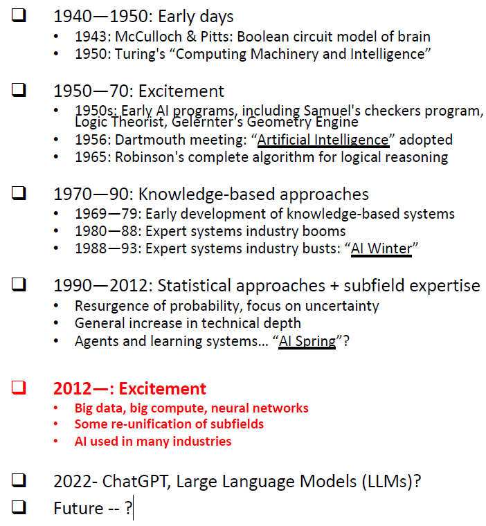

# Chapter1 Introduction

## What is Artificial Intelligence

AI is the ability of a computer program or a machine to think and learn.

It is also a field of study which tries to make computers "smart". They work on their own without being encoded with commands.&#x20;

## What is Big Data

Big data is a collection of data sets so large and complex that it becomes difficult to process using onhand database management tools or traditional data processing applications.

### Characteristics of Big Data: 4V

* Volume(数量)
* Velocity(速度)
* Variety(变化)
* Veracity(真实性)

## What is Data Mining

Discovery of patterns and models that are:

* Valid: hold on new data with some certainty
* Useful: should be possible to act on the item
* Unexpected: non-obvious to the system
* Understandable: humans should be able to interprt the pattern

A particular data analytic technique

### Data Mining Tasks

* Descriptive Methods: Find human-interpretable patterns that describe the data
* Predictive Methods: Use some variables to predict unknown or future values of other variables

## What is Machine Learning

Machine Learning is the field of study that gives the computer the ability to learn without being explicity programmed.&#x20;

ML is the study of algorithms that

* Improve their <mark style="color:blue;">`P`</mark>erformance
* At some <mark style="color:blue;">`T`</mark>ask
* With <mark style="color:blue;">`E`</mark>xperience

Hence a well-defined learning task is given by three elements \<P, T, E>.

## What is Deep Learning

Deep Learning is a class of machine learning algorithm that leverages multiple layers to progressively extract higher level features from raw output.&#x20;

DL is multi-layered neural networks, where the "deep" in deep learning refers to the number of "higgen layers" between input and output.&#x20;

<figure><figcaption>
AI History
</figcaption></figure>

