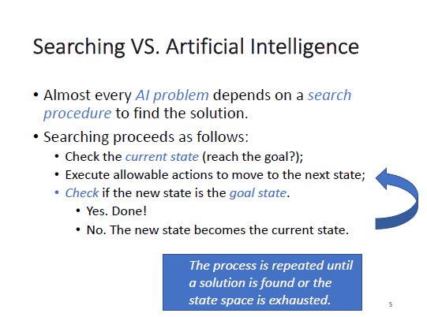

# Chapter2 Searching Techniques

## What is searching

Searching is the process of looking for the solution of a problem through a set of states.&#x20;

### Search conditions

*   Current state

    the step of where we are
*   Goal state

    the step where the solution is found
*   Actions

    move one state to another
*   Cost

    how many steps needed to find the solution

### Solution

a path from the current state to the goal state.&#x20;

<figure><figcaption>
Searching VS Artificial Intelligence (AI)
</figcaption></figure>

## How to evalue Searching

*   Optimality

    需要最小的cost就能达到目标（找到的solution是最优的）
* Time Complexity（时间复杂度）
* Space Complexity（空间复杂度，memory）
*   Completeness

    guaranteed to find a solution(before the resource exhausted)，这瓜保熟嘛？

## Types

[uninformed-blind-search](uninformed-blind-search/ "mention") [informed-heuristic-search](informed-heuristic-search/ "mention")
