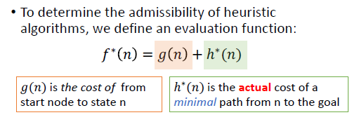
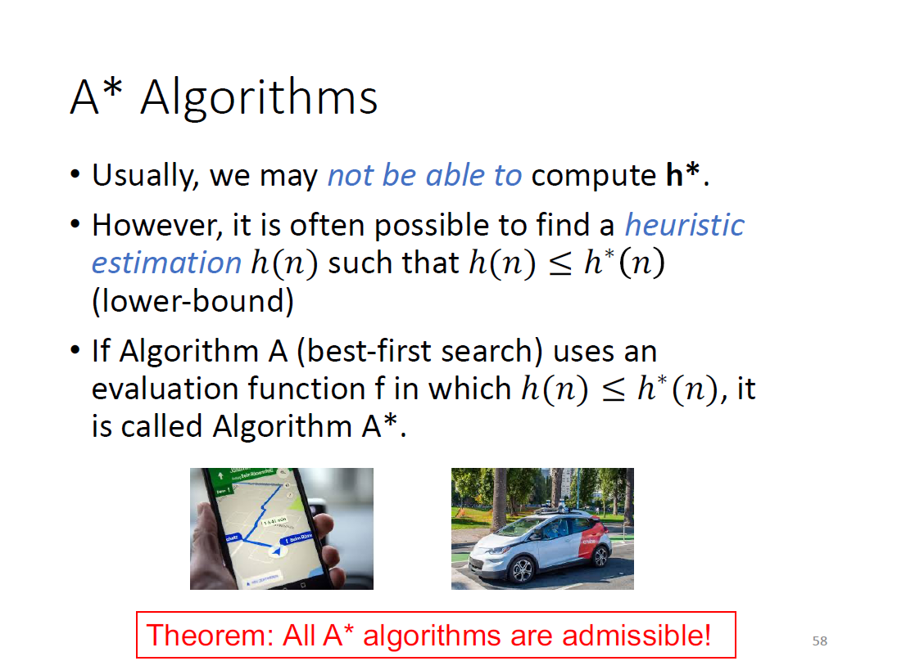
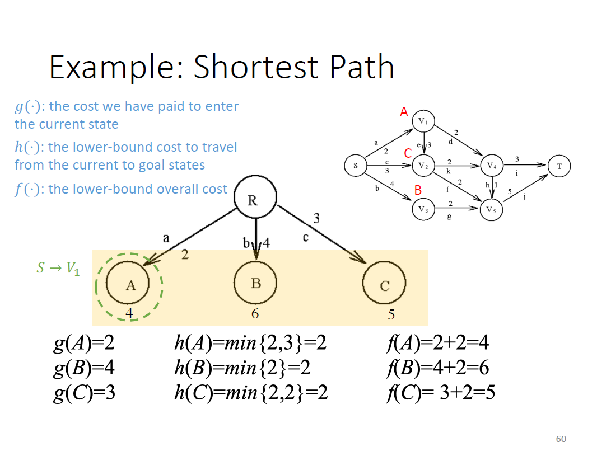

# A\* Algorithm

## Admissibility

如果一个搜索算法是Admissible，那么它一定能找到一个最短路解决方案（如果存在的话）（guaranteed to find a minimal solution path）

BFS is admissible，但是它经常inefficient

<figure><figcaption></figcaption></figure>

<figure><figcaption></figcaption></figure>

<figure><figcaption></figcaption></figure>
