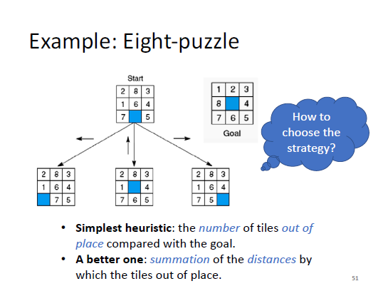

# Greedy Search (Best-first Search)

贪心搜索每次都向着（预估cost最小的方向）前进，这个预估cost可以是heuristics。（It seeks to minimize the estimated cost (i.e., heuristics) to the goal by expanding the node that is closest (lowest heuristics) to the goal state）。

换句话说，it always expands the heuristically best nodes first。

<figure><figcaption>
Example of Greedy Search in 八皇后
</figcaption></figure>

一个good heuristics is empirical and difficult to design

## Completeness

not complete

not optimal

如果不检查是否访问节点的话，还会卡在infinite loop

## Time Complexity

$$
O(b^d)
$$

## Space Complexity

$$
O(b^d)
$$

