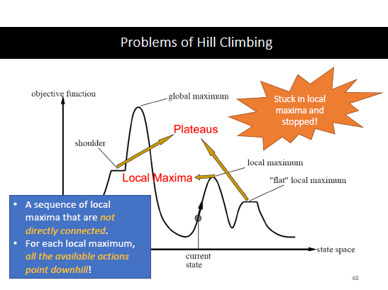

# Hill Climbing

只看目标状态，不考虑历史（每次都往最高的山峰攀爬）

<figure><figcaption>
Example of Hill Climbing in Tic-Tac-Toc
</figcaption></figure>

但是这个方法有可能陷入局部最优解

<figure><figcaption>
Problems of Hill Climbing
</figcaption></figure>
