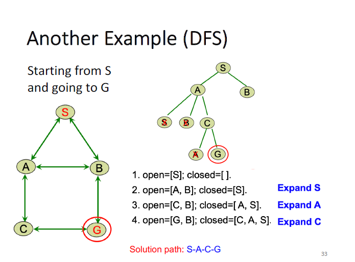

# Depth-first Search (DFS)

<figure><figcaption>
pseudocode of DFS
</figcaption></figure>

<figure><figcaption>
pseudocode of DFS using Stack
</figcaption></figure>

<figure><figcaption>
Example of DFS
</figcaption></figure>

直到从open list中获取到目标状态就停止，不更新closed list

## Completeness

不一定，如果没有closed list的重复判断，会被环（loops）困住，导致无限深度。但如果没有环，就是complete的（complete in finite spaces）。但是不总是找到最短路径。

## Time Complexity

$$
O(b^d)
$$

* b是树的分叉数量
* d是树的最大深度（层数-1）

## Space Complexity

$$
O(d*b)
$$

因为只保留当前搜索的分支和向上的所有邻居节点的信息。
