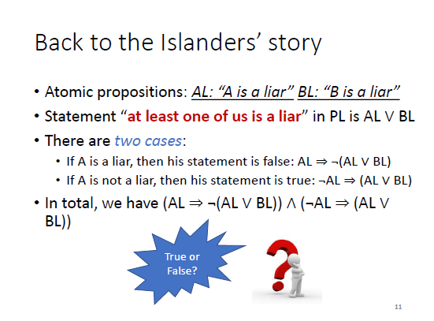

# Chapter3 Knowledge Representation

## What is logic

logic is a formal method for reasoning (logical inference)

Logic translates concepts into symbolic representation, which closely approximate the meaning of these concepts

The symbolic structures can be manipulated to deduce various facts and carry out a form of automated reasoning.

## What is Propositional Logic(PL) and First Order Logic(FOL)

PL and FOL are old yet useful schemes for knowledge representation(KR) in AI.

Logic offers the only formal approach to reasoning that has a sound theoretical foundation.

PL can be viewed as a special case of FOL.&#x20;

## Propositional Logic

### Syntax

defines the structure of the language

### Semantics

define the "meaning" of sentences (e.g., True or False)

### Deduction rules

how to deduce consequences from a collection of facts

<figure><figcaption>
小岛上的人要么是诚实人要么是说谎人
</figcaption></figure>

### Satisfiability and Validity

#### Satisfiable

if there is some interpretation for which it is true

#### Unsatisfiable

if there is no interpretation for which it is true

#### Valid

if every interpretation is true

## Equivalence

<figure><figcaption>
Equivalence
</figcaption></figure>

## Proof Methods

### Forward Chaining

就是从条件出发，看看能不能推出结果

### Backward Chaining

就是从结果出发，算出最终条件是否能满足

### Resolution

条件合并
