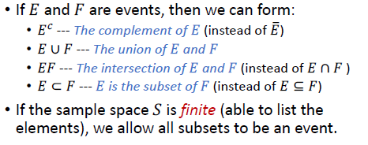
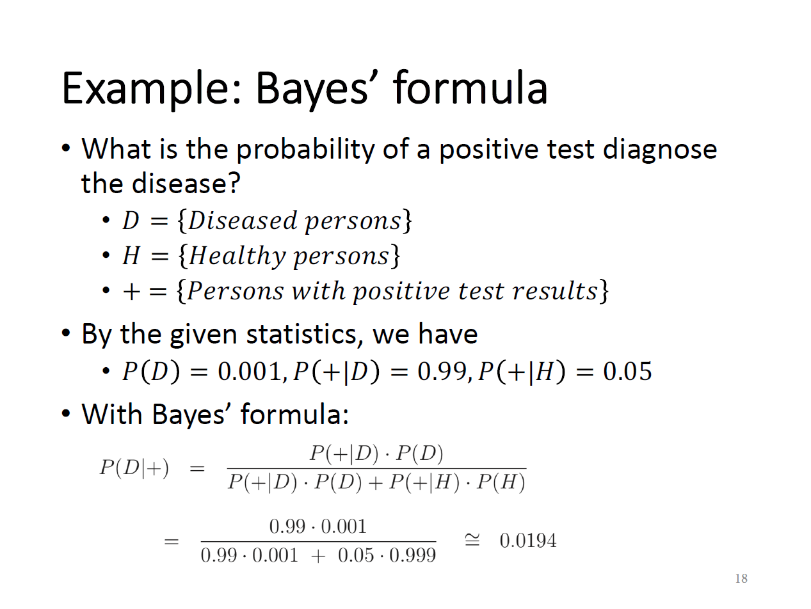
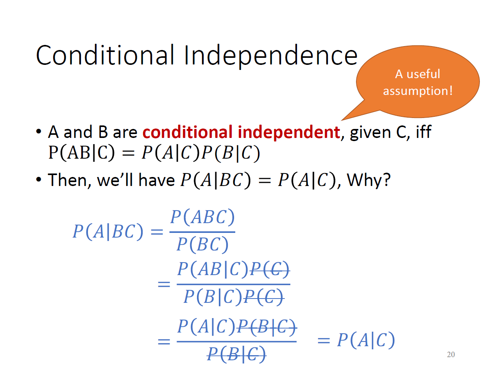
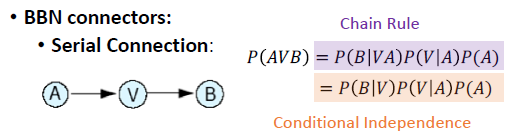
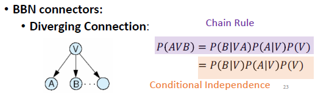
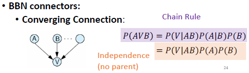

# Chapter4 Uncertainty (Bayesian)

## What is Probability

Probability is a numerical description of how likely an event is to occur and or how likely that a proposition is true.

可以通过随机实验，用频率代替概率

## What is Sample Space

The set of all possible outcomes of an experiment.

$$
S=\{H,T\}
$$

* H是硬币向上（Heads up）
* T是硬币向下（Tails up）

## What is Event

Subsets of the sample space. 例如一个抛硬币的event可以是E={1. 3, 4}。

### Event的代数表达式

<figure><figcaption>
The Algebra of Events
</figcaption></figure>

## 条件概率（Conditional Probability）

$$
P(E|F) = \frac {P(EF)} {P(F)}, \ P(F) \neq 0
$$

### 如果俩event独立

$$
P(E|F) = \frac {P(EF)} {P(F)} =  \frac {P(E)P(F)} {P(F)} = P(E), \ P(F) \neq 0
$$

换句话说，是否知道F对E的概率并没有影响。

## Bayes' Formula（贝叶斯公式）

$$
P(F|E) = \frac {P(EF)} {P(E)} = \frac {P(E|F)P(F)} {P(E|F)P(F)+P(E|F^c)P(F^c)}
$$

<figure><figcaption>
Example of Bayes' formula
</figcaption></figure>

## Chain Rule

$$
P(A_1A_2 \ldots A_n) = \\ P(A_1|A_2A_3 \ldots A_n)P(A_2|A_3A_4 \ldots A_n) \ldots P(A_{n-1}|A_n)P(A_n)
$$

<figure><figcaption>
Example of Chain Rule ini Independence mode
</figcaption></figure>

## Bayesian Belief Networks

是一个图模型，连接的边表示有节点（event node）转换到不同event的概率。

### Serial Connection

<figure><figcaption></figcaption></figure>

### Diverging Connection

<figure><figcaption></figcaption></figure>

### Converging Connection

<figure><figcaption></figcaption></figure>
