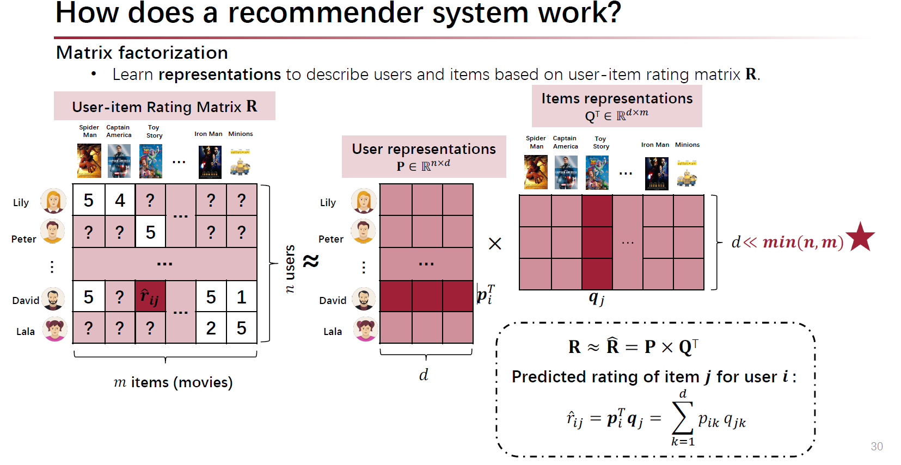

# Collaborative Filtering(CF)

基本假设：

* 用户会（显式或隐式地）对商品打分
* 在历史中展现出相近兴趣的用户，也会在未来具有相似的爱好

<figure><figcaption></figcaption></figure>

当用户（User）和候选集（Item）逐渐增多时，User-item矩阵显著增大，基本的思想是通过矩阵分解解决数据存储的问题。最基本的方式是通过低纬秩d将User-item大矩阵分解成两个较小的矩阵。该维度d可以作为embedding的维度。

$$
R\approx \widehat{R}=P \times Q^{\tau}
$$

若使用重构误差作为损失目标（rating reconstruction error），则损失函数如下：

$$
{min}_{p,q}{\sum_{{i,j}\in{S}}({r_{ij}-\widehat{r}_{i,j}})^2}={\sum_{{i,j}\in{S}}}({r_{ij}-p_iq_j^{\tau})^2}
$$

若采用奇异值分解（Singular Value Decomposition, SVD），那么矩阵如下：

$$
M=U \times \Sigma \times V^{\tau}
$$

其中，中间的sigma矩阵（是一个对角矩阵）中的值是singular values，我们可以通过取the most important features（最大singular values的），然后就可以用简化的U和V相乘了。

## 评价指标

### MAE (Mean-Absolute Error)

### RMSE (Root Mean Squared Error)

## 通过Biases和Regularization平滑的矩阵分解

由于用户对item会有偏好，并且item间也有偏差，所以引入对两者的刻画。

将item的predicted rating更正为：

$$
\hat r_{ij} = p^\tau_iq_j = \sum^d_{k=1}p_{ik}q_{jk} + b_i^p + b_j^q
$$

并且将Objective转化成正则化的形式：

$$
\min_{P,Q} \sum_{i,j \in S} {(r_{ij}-\hat r_{ij})}^2 =  \sum_{i,j \in S} {(r_{ij}-\hat r_{ij})}^2 + \lambda\sum_i^n{\sum_j^m {({\Vert p_i \Vert}^2+{\Vert q_j \Vert}^2 + {\Vert b_i^p \Vert}^2 + {\Vert b_j^q \Vert}^2)}}
$$
