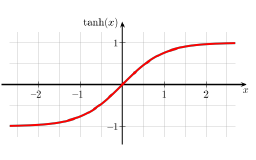
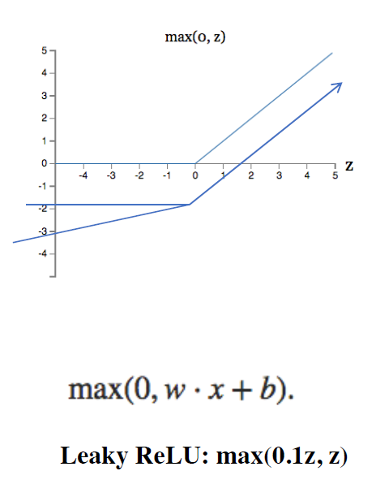
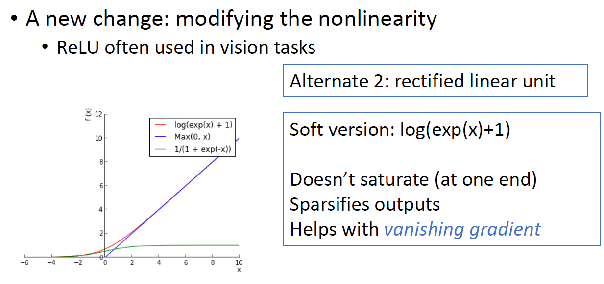
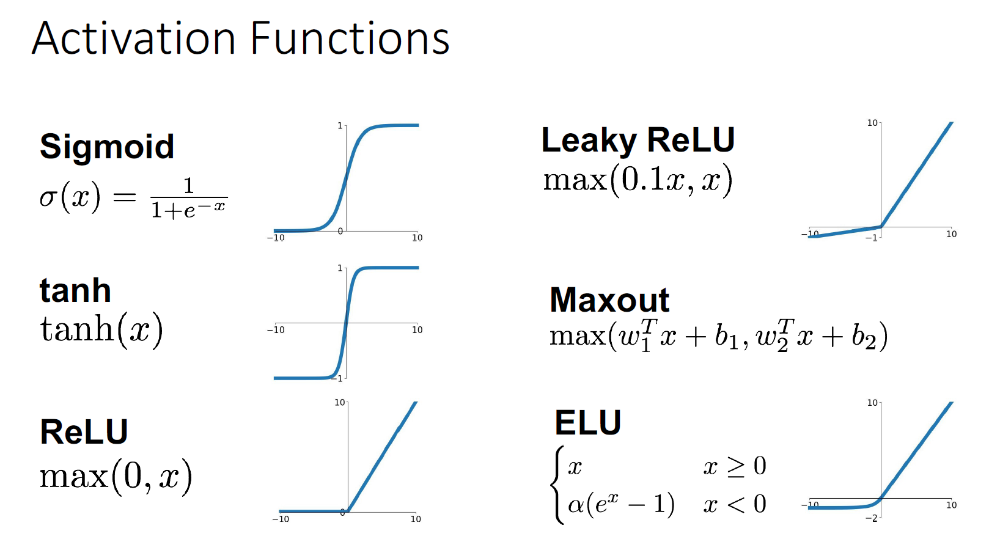

# Chapter7 Neural Network

## Logistic Regression

$$
y=h_\theta(x)=\sigma(\theta^\tau x) \\ where\ \sigma(\alpha)=\frac 1 {1+\exp(-\alpha)}
$$

<figure><figcaption>
Sigmoid Function
</figcaption></figure>

## Tanh

<figure><figcaption>
Tanh Function
</figcaption></figure>

## ReLU & Weak ReLU

<figure><figcaption>
ReLU and Weak ReLU
</figcaption></figure>

## Soft Sigmoid

<figure><figcaption>
Soft Sigmoid
</figcaption></figure>

## Activation Functions

<figure><figcaption></figcaption></figure>

## Softmax

$$
y_k = \frac {\exp(b_k)} {\sum^K_{l=1}\exp(b_l)}
$$
