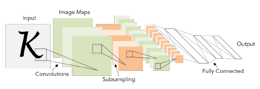
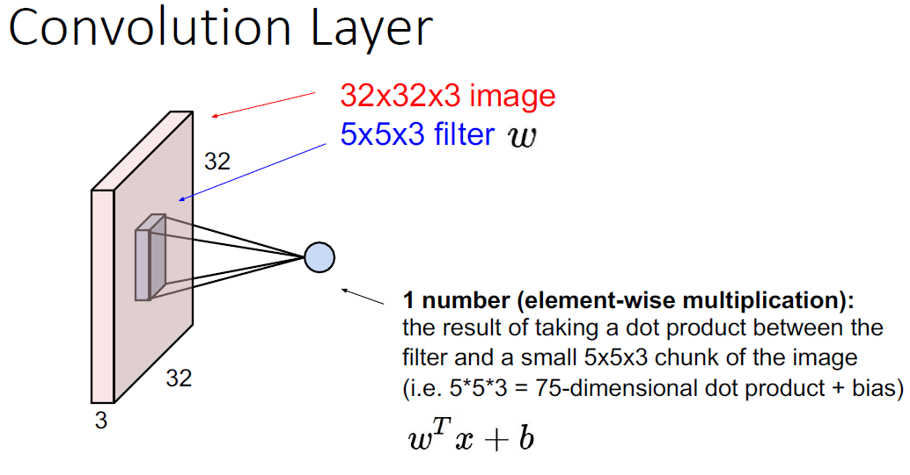

# CNN (Convolutional Neural Networks)

<figure><figcaption>
CNN Visualization
</figcaption></figure>

## 怎么算卷积核参数

<figure><figcaption></figcaption></figure>

## 怎么计算卷积后大小

$$
size=(insize + 2*padding - filterSize)/slide + 1
$$

